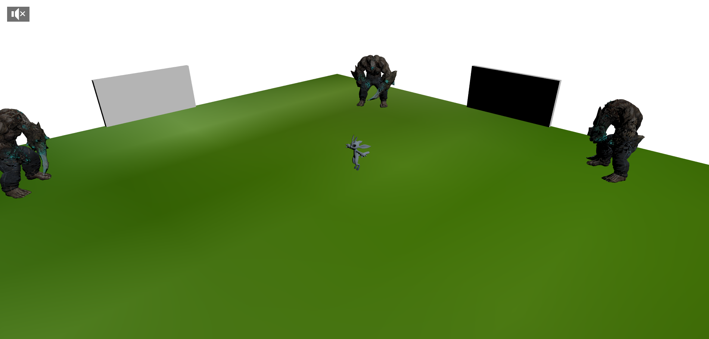
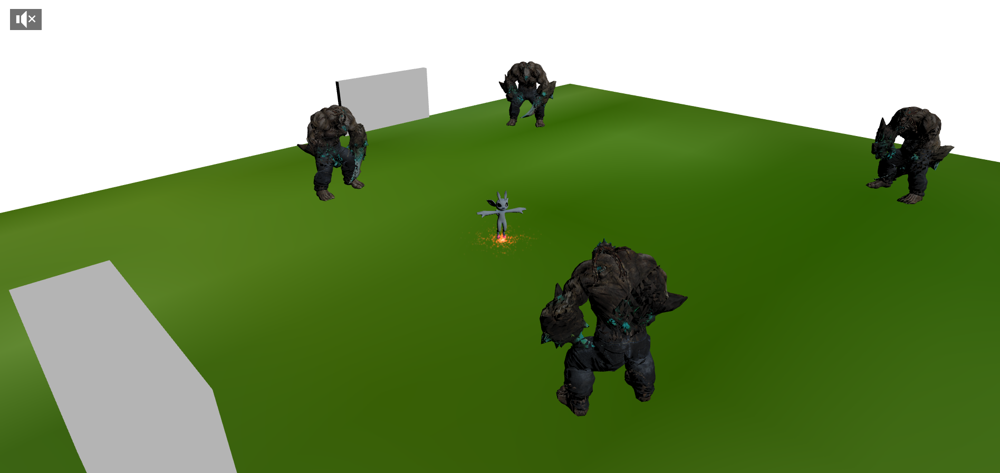
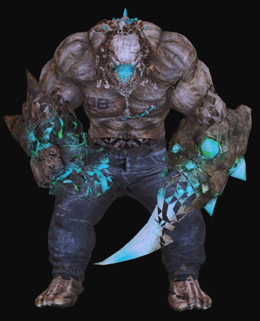
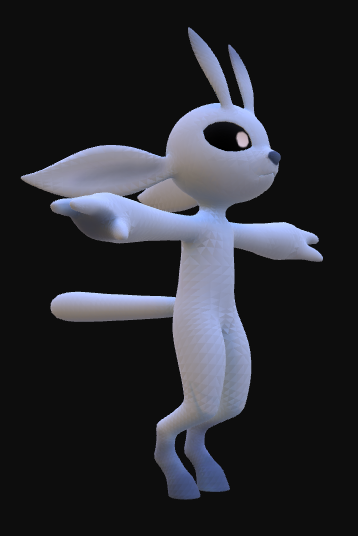
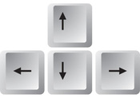

# NIRWEN : a 3DGames with BabylonJS for Games On Web 2023 
## Lucas LYON, Mohamed MAHJOUB

Theme :  *Be green*

# Description :
Nirwen est un RogueLike en vue isométrique suivante.
Le joueur incarne "Ori", un être magique au sorts multiple et se rendant plus impressionnant devant ses ennemis en écartant les bras. Très craintif, il est très rare de les voirs repliés.
Celui-ci se défend contre ses ennemis, les terribles mutants, en envoyant des valses de picks de glace. En cas de trop forte proximité, celui-ci peut utiliser un forceshield, un puissant pouvoir repoussant ses adversaires.

# Ennemis :

Les seuls êtres encore apte à affronter Ori sont des mutants : des créatures dont les nombreuses altérations ont réduit leur stratégie d'attaque à seulement entrer en collision avec ses opposants. Les mutants sont des êtres terriblements téritoriaux : bien que tolérant la présence d'autres mutants, ceux-ci refuseront catégoriquement de se s'éloigner de la salle qu'ils se sont attribué. Certains disent qu'ils auraient simplement une phobie des portes.

# Labyrinthe
Ori évolue dans un milieu générer aléatoirement à chaque partie afin d'acroîte l'expérience de jeu. Bien qu'aléatoirement réparti, chaque salles ne contient pas moins de 3 mutants, mais jamais plus de 5.

# Ori :

Ori est capable d'envoyer une salves de 5 picks de glace à chaque secondes
Il est également capable d'utiliser un champ de force afin de mettre à distance ses adversaires. Cependant, celui se rechargge plus lentement.

# Controle

Déplacer Ori : utilisez les flèches directionnelles ou les touches zqsd pour faire avancer, reculer ou orienter Ori
Sortilèges : 
- ice_picks : presser la touche i pour envoyer un balayage de pick de glaces
- forceshield : presser la touche f pour activer le forcehield
